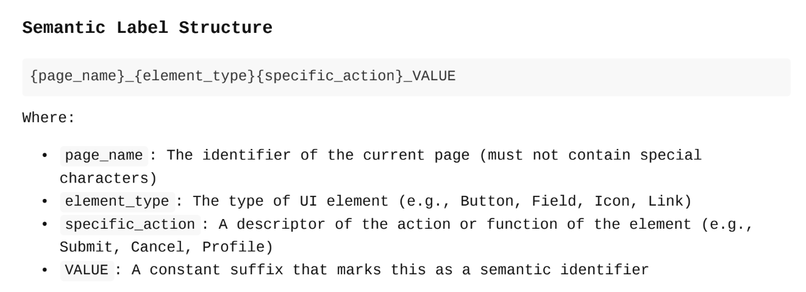

# A Practical Guide to Effectively Using Semantic Labels and Wrappers in Flutter

<aside>
🧷

**I. Semantic label template**

**II. Semantic wrapper**

**III. Semantic for unit widget**

**IV. Apply to development**

**V. Source**

</aside>

### I. Semantic label template

<aside>
📌

Define the information of a label through the Semantic Label Template to facilitate detection, analysis, and the creation of automated test cases. By doing this, we synchronize the inputs and outputs among stakeholders, ensuring a consistent development process and minimizing conflicts as much as possible. This template serves as a standardization tool, making usability testing and quality assurance more efficient.

</aside>

1. **Config label structure**



```dart
/// A template for semantic information.
abstract class SemanticInformationTemplate {
  String get pageName;

  String get elementType;

  String get specificAction;

  String get value => 'VALUE';

  String get semanticTemplate => [pageName, '$elementType$specificAction', value].join('_');
}
```

1. **Get information**

```dart
class SemanticLabelInformation extends SemanticInformationTemplate {
  final BuildContext context;
  final String type;
  final String action;

  SemanticLabelInformation({
    required this.context,
    required this.type,
    required this.action,
  });

	/// A map of page names to be used in the semantic label.
  static final Map<String, String> pageNames = {
    '/': 'Home',
    '/products': 'ProductPage',
  };

  String getPageName(String? path) {
    return pageNames[path] ?? 'UnknownPage';
  }

  /// Returns the name of the current page based on the context.
  @override
  String get pageName {
    try {
      return getPageName(ModalRoute.of(context)?.settings.name);
    } catch (e, st) {
      return 'UnknownPage';
    }
  }

  @override
  String get elementType => type;

  @override
  String get specificAction => action;

  SemanticLabelInformation copyWith({
    BuildContext? context,
    String? type,
    String? action,
  }) {
    return SemanticLabelInformation(
      context: context ?? this.context,
      type: type ?? this.type,
      action: action ?? this.action,
    );
  }
}
```

### II. Semantic wrapper

<aside>
📌

The Semantic Wrapper is a class that acts as a wrapper for widgets, helping to apply semantic label information to interface elements within the application. Using the Semantic Wrapper improves the accessibility of the app, allowing assistive tools such as screen readers to correctly interpret and communicate information about the elements on the user interface. By wrapping widgets in Semantic Wrapper classes, we can flexibly adjust how interface components are presented and interacted with, while ensuring consistency across the entire application.

</aside>

<aside>
ℹ️

In Flutter, some widgets include a label within their properties, while others do not.

</aside>

1. **Create a sample custom widget (ProductCard)**

```dart
import 'package:flutter/material.dart';

class ProductCard extends StatelessWidget {
  const ProductCard({super.key});

  @override
  Widget build(BuildContext context) {
    return const Card(
      semanticContainer: false, //set false to show position of child
      child: Row(
        children: [
          Icon(
            Icons.image,
            size: 80,
            semanticLabel: 'Product Image',
          ),
          Expanded(
            child: Column(
              crossAxisAlignment: CrossAxisAlignment.start,
              children: [
                Text('Product Name', style: TextStyle(fontWeight: FontWeight.bold)),
                Text('Product Description', style: TextStyle(color: Colors.grey)),
              ],
            ),
          ),
        ],
      ),
    );
  }
}

/// An example page

class SemanticExamplePage extends StatelessWidget {
  const SemanticExamplePage({super.key});

  @override
  Widget build(BuildContext context) {
    return Scaffold(
      appBar: AppBar(
        title: const Text('Semantic Example'),
      ),
      body: const Column(
        children: [
          ProductCard(),
        ],
      ),
    );
  }
}

```


---

**Implement Wrapper Semantic Widget**

1. **Exclude Semantic**

```dart
///  All child semantics nodes are ignored
class WrapperExcludeSemantic extends StatelessWidget {
  const WrapperExcludeSemantic({
    super.key,
    required this.information,
    required this.child,
  });

  final SemanticLabelInformation information;
  final Widget child;

  @override
  Widget build(BuildContext context) {
    return Semantics(
      excludeSemantics: true,
      label: information.semanticTemplate,
      child: child,
    );
  }
}

// An example for product card
class SemanticExamplePage extends StatelessWidget {
  const SemanticExamplePage({super.key});

  @override
  Widget build(BuildContext context) {
    return Scaffold(
      appBar: AppBar(
        title: const Text('Semantic Example'),
      ),
      body: Column(
        children: [
          WrapperExcludeSemantic(
            information: SemanticLabelInformation(
              context: context,
              type: 'ProductCard',
              action: 'View',
            ),
            child: ProductCard(),
          ),
        ],
      ),
    );
  }
}
```

> Turn on: `showSemanticsDebugger: true in MaterialApp`  to `*shows the accessibility information reported by the framework.*`
>


1. **ExplictSemantic**

```dart
/// All child semantics nodes are explicitly included
class WrapperExplicitSemantic extends StatelessWidget {
  const WrapperExplicitSemantic({
    super.key,
    required this.information,
    required this.child,
  });

  final SemanticLabelInformation information;
  final Widget child;

  @override
  Widget build(BuildContext context) {
    return Semantics(
      explicitChildNodes: true,
      label: information.semanticTemplate,
      child: child,
    );
  }
}

```


> **Do not see the label value in screen but…see in Inspector**
>


### III. Semantic for unit widget

<aside>
📌

Semantic for unit widget is a method of applying semantic labels to individual widgets such as Text, Icon, and Button, enhancing the accessibility of each component in the user interface. Instead of wrapping widgets in general Semantic Wrapper classes, this approach allows semantic labels to be directly applied to small, standalone widgets, ensuring that each element has complete and accurate information for assistive tools like screen readers. This helps improve navigation and interaction with interface components, providing a better user experience for individuals using assistive technologies.

</aside>

1. **Create a visitor to update these widgets**

```dart
class AutoSemanticWrapper extends StatefulWidget {
  final Widget child;

  const AutoSemanticWrapper({required this.child, super.key});

  @override
  State<AutoSemanticWrapper> createState() => _AutoSemanticWrapperState();
}

class _AutoSemanticWrapperState extends State<AutoSemanticWrapper> {
  Widget _wrapWithSemantics(Widget widget) {
    //handle wrap here
  }

  @override
  Widget build(BuildContext context) {
    return _wrapWithSemantics(widget.child);
  }
}
```

1. **Let’s implement _wrapWithSemantics method**

```dart
   Widget _wrapWithSemantics(Widget widget) {
    /// dig into layout widgets
    if (widget is Row) {
      return widget.copyWith(children: widget.children.wrapWithAutoSemantic());
    }

    if (widget is Column) {
      return widget.copyWith(children: widget.children.wrapWithAutoSemantic());
    }

    if (widget is Expanded) {
      return widget.copyWith(child: widget.child.wrapWithAutoSemantic());
    }

    if (widget is Card) {
      return widget.copyWith(child: widget.child?.wrapWithAutoSemantic());
    }

    if (widget is Scaffold) {
      return widget.copyWith(body: widget.body?.wrapWithAutoSemantic());
    }

    ///Todo: ...implements more layout widgets

    /// bypass widget
    /// [CWidget] is used to bypass the widget from auto semantic wrapping
    /// We can wrapper inside [CWidget] or do nothing
    if (widget is CWidget) {
      return widget;
    }

    /// wrap widget with semantic

    /// [type] is used to identify the type of the widget
    final type = widget.runtimeType.toString();

    /// [action] is used to identify the action of the widget
    /// implement your own logic to get the action
    final action = 'AutoWrap';
    return widget.withExcludeSemantic(
      context: context,
      type: type,
      action: action,
    );
  }
  
  ////[CWidget] used to bypass the widget from auto semantic wrapping
	mixin CWidget {}

```

1. **Use for product card**

```dart
AutoSemanticWrapper(child: ProductCard()),
```


### IV. Apply to development

<aside>
ℹ️

The goal is to quickly apply and modify semantic labels with minimal risk of conflicts and errors. This approach ensures that the integration of accessibility features into the development process is efficient and smooth, allowing for easy adjustments without introducing issues into the system.

</aside>

1. **Create extension to return a widget by function**
- Add new code to exists code easier
- Reduce change history code

```dart
///1. Wrapper semantic widget
extension SemanticWidgetX on Widget {
  Widget withExcludeSemantic({
    required BuildContext context,
    required String type,
    required String action,
  }) {
    return WrapperExcludeSemantic(
      information: SemanticLabelInformation(
        context: context,
        type: type,
        action: action,
      ),
      child: this,
    );
  }

  Widget withExplicitSemantic({
    required BuildContext context,
    required String type,
    required String action,
  }) {
    return WrapperExplicitSemantic(
      information: SemanticLabelInformation(
        context: context,
        type: type,
        action: action,
      ),
      child: this,
    );
  }
}

///2. Auto wrapper semantic
extension AutoSemanticWrapperX on Widget {
  Widget wrapWithAutoSemantic() {
    return AutoSemanticWrapper(child: this);
  }
}

extension AutoSemanticWrapperChildrenWidgetX on List<Widget> {
  List<Widget> wrapWithAutoSemantic() {
    return map((e) => e.wrapWithAutoSemantic()).toList();
  }
}
```

1. **Explain**

   2.1. Exists code

   

   2.2. Wrap Widget by traditional way

   

   2.3. Return by method way

   


> **The history will change follow by the highlight lines in 2.2. and 2.3.**
>

### V. Source

Git: https://github.com/1712916/semantic_wrapper
